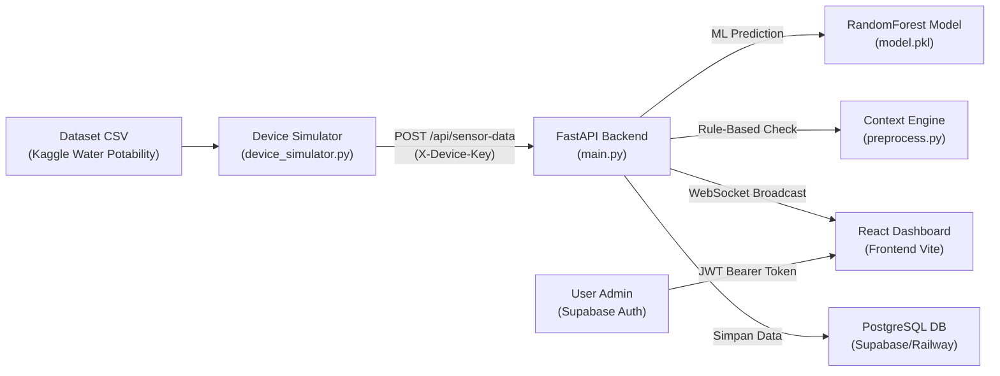

# 🌊 AquaWare — Arsitektur & Penjelasan Teknis

Dokumen ini merangkum seluruh arsitektur teknis, alur data, dan penjelasan fungsional dari sistem AquaWare.

---

## 🚀 Ringkasan Cara Kerja (Bagi Non-Teknis)

Sederhananya, AquaWare adalah **sistem pemantau kualitas air pintar**. Sistem secara otomatis mendeteksi apakah air di suatu tempat (tandon, pipa pasokan, atau danau) aman dan layak minum.

Karena sistem ini masih dalam tahap *software simulation* (belum diintegrasikan dengan sensor mikrokontroler fisik seperti Arduino/ESP32), kami menggunakan **Simulator** (berbasis Python) yang membaca rekaman historis dari Dataset Kaggle lalu menembakkannya ke server seolah-olah itu adalah data *real-time* dari perangkat fisik. 

Begitu data masuk ke server, "Otak Buatan" (*Machine Learning*) milik AquaWare akan menganalisis kandungannya dan menampilkan status kelayakan secara seketika (*Real-Time*) di layar Dashboard pengguna!

---

## 🛠️ Arsitektur Sistem Global

---

## ⚙️ Komponen-Komponen Utama

### 1. 📊 Machine Learning Pipeline (AI)
Menggunakan model **RandomForestClassifier** yang terlatih untuk mengklasifikasikan air menjadi layak atau tidak layak minum.
- **9 Fitur Sensor:** `pH`, `Hardness`, `Solids`, `Chloramines`, `Sulfate`, `Conductivity`, `Organic_carbon`, `Trihalomethanes`, `Turbidity`.
- **Pre-processing Otomatis:** Sistem secara pintar menangani data yang hilang (missing values) menggunakan teknik *median imputation*.

### 2. 🧠 Context Engine (Rule-Based)
Ini adalah fitur unik AquaWare yang menjadikannya **"Context-Aware"**. Selain prediksi dari AI, sistem juga memvalidasi data terhadap standar mutlak dari **WHO / Permenkes (492/2010)**.

| Parameter Fisik/Kimia | Standar Batas Aman |
|---|---|
| **pH (Tingkat Keasaman)** | 6.5 – 8.5 |
| **Turbidity (Kekeruhan)** | ≤ 5.0 NTU |
| **Sulfate** | ≤ 250 mg/L |
| **Chloramines** | ≤ 4.0 mg/L |
| **Trihalomethanes** | ≤ 80 µg/L |

> [!TIP]
> Jika ada satu nilai saja yang melanggar standar di atas, *Context Engine* akan memberikan peringatan interaktif di Dashboard lengkap dengan penjelasannya (Misal: *"pH terlalu tinggi: 9.1 (maksimal 8.5)"*).

### 3. 🖥️ Backend API (FastAPI)
Merupakan tulang punggung sistem yang menangani aliran data berkecepatan tinggi.

| Endpoint | Method | Autentikasi | Fungsi |
|---|---|---|---|
| `/api/sensor-data` | `POST` | `X-Device-Key` | Menerima data sensor, melakukan proses ML, menyimpan ke DB, dan *broadcasting*. |
| `/api/latest` | `GET` | JWT Token | Menarik data pembacaan detik terakhir. |
| `/api/history` | `GET` | JWT Token | Menarik riwayat panjang pembacaan untuk grafik/tabel. |
| `/api/export` | `GET` | JWT Token | Mengunduh riwayat data ke dalam format Excel (CSV). |
| `/ws` | `WS` | JWT Token (Query) | Kanal komunikasi dua arah secara *Real-Time*. |

### 4. 🖼️ Frontend Dashboard
Antarmuka pengguna moderen yang dibangun dengan **React** & **Vite**. Menampilkan desain elegan berbahan dasar *Glassmorphism*.
- **Real-Time Indicators:** Status kelayakan dan meter probabilitas AI berkedip dan bereaksi seketika terhadap data masuk.
- **Trend Charts:** Grafik garis mulus (menggunakan Recharts) yang terus bergeser untuk menampilkan pergerakan kualitas air secara langsung.
- **Data Tables & Exports:** Memungkinkan administrator menelusuri ratusan log historis dan mengunduhnya hanya dengan satu klik.

---

## 🔒 Security Hardening (Keamanan Tingkat Lanjut)

Meskipun ini merupakan purwarupa, sistem telah dibekali arsitektur keamanan tingkat *production*:
- **Dual Authentication**: Memisahkan login interaktif (JWT Supabase untuk manusia) dari login mesin (API Keys).
- **Rate Limiting (Anti-DDoS)**: Pembatasan laju trafik otomatis melalui *SlowAPI* — misalnya 5 kali gagal login akan diblokir, dan pengiriman sensor dicekik maksimal 120 pesan per menit.
- **CORS Protection**: Filter domain ketat yang menolak permintaan dari website bajakan yang tidak terdaftar.

---

## 📝 Catatan Untuk Dosen Penguji / Presentasi

Saat melakukan demo tugas/presentasi, harap tekankan poin penting ini:
> *"Data yang ditampilkan saat ini bersumber dari perangkat Simulator cerdas. Namun, karena keseluruhan arsitektur jaringan (Payload JSON, Endpoint, Database, hingga WebSockets) telah dibangun dengan standar industri IoT, transisi ke Perangkat Keras Asli (Hardware) di masa depan dapat dilakukan hanya dalam hitungan menit — tanpa perlu mengubah satupun susunan kode pada sistem utama."*
