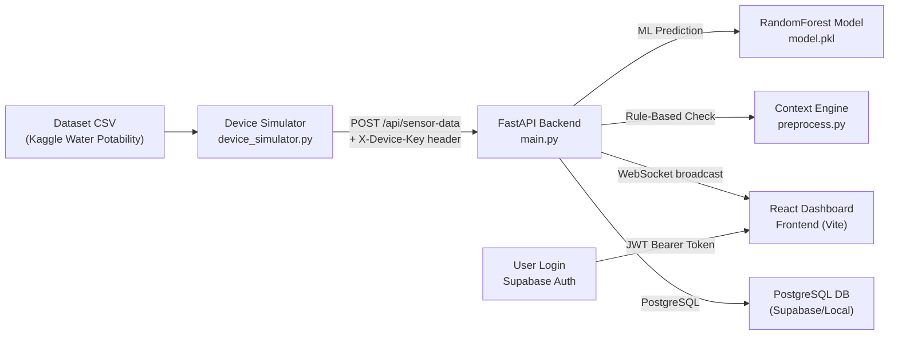
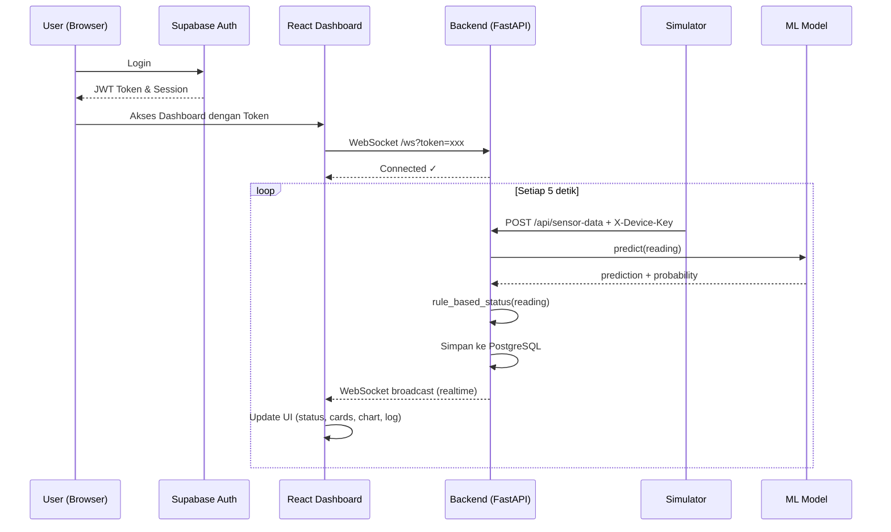

# 🌊 AquaWare — Penjelasan Lengkap Project

## 💡 Penjelasan Sederhana (Bahasa Orang Awam)

Bayangkan project ini sebagai **sistem pemantau kualitas air pintar**. 
Tujuan utamanya adalah secara otomatis mendeteksi apakah air di suatu tempat (misalnya tandon atau danau) aman dan layak minum atau tidak.

Karena saat ini kita **belum punya alat sensor fisiknya** (seperti alat Arduino/ESP32 sungguhan), kita menggunakan program **"Simulator"**. Simulator ini bertugas *berpura-pura* menjadi alat sensor. Caranya adalah dengan membaca data dari file Excel/CSV (dataset dari Kaggle) yang berisi contoh-contoh kualitas air, lalu mengirimkannya ke sistem kita setiap beberapa detik.

Sistem kita (Backend) punya "otak buatan" (**Machine Learning**) yang akan memproses data tersebut dan langsung menebak: *"Apakah air ini layak minum?"*. Hasil tebakannya ini akan langsung berkedip dan muncul di layar komputermu (Dashboard) secara *real-time* atau langsung saat itu juga!

---

## 🚀 Cara Cepat Menjalankan Project (Quick Start)

Jika kamu ingin langsung melihat project ini berjalan, ikuti 3 langkah mudah ini (pastikan kamu sudah buka terminal/Command Prompt di folder project ini):

**Langkah 1: Jalankan Mesin Utama (Backend)**
Buka terminal dan ketik perintah ini:
`python -m uvicorn backend.main:app --reload --port 8000`
*(Biarkan terminal ini tetap terbuka dan berjalan)*

**Langkah 2: Nyalakan Sensor Buatan (Simulator)**
Buka terminal **baru** (jangan tutup yang lama), lalu ketik:
`python simulator/device_simulator.py`
*(Ini akan membuat program mulai mengirim data air bohongan ke server tiap 5 detik)*

**Langkah 3: Jalankan Aplikasi Layar (Frontend)**
Buka terminal **baru** (ketiga), masuk ke folder `frontend`, lalu install dependencies dan jalankan:
`cd frontend`
`npm install`
`npm run dev`
*(Buka URL yang muncul di terminal, misal http://localhost:5173)*

---

## 🛠️ Penjelasan Teknis & Arsitektur Sistem (Tingkat Lanjut)

## Arsitektur Sistem

---

## Struktur File & Penjelasan

| File/Folder | Fungsi |
|---|---|
| [data/water_potability.csv](file:///d:/Tugas/Semester%206/KPU/water-quality-iot/data/water_potability.csv) | Dataset kualitas air (Dataset asli Kaggle Water Potability) |
| [ml/preprocess.py](file:///d:/Tugas/Semester%206/KPU/water-quality-iot/ml/preprocess.py) | Preprocessing data + rule-based context engine (ambang batas WHO/Permenkes) |
| [ml/train_model.py](file:///d:/Tugas/Semester%206/KPU/water-quality-iot/ml/train_model.py) | Training model RandomForest → menghasilkan `model.pkl` |
| [ml/model.pkl](file:///d:/Tugas/Semester%206/KPU/water-quality-iot/ml/model.pkl) | Model ML yang sudah dilatih (~1.5 MB) |
| [backend/main.py](file:///d:/Tugas/Semester%206/KPU/water-quality-iot/backend/main.py) | FastAPI server: REST API + WebSocket + PostgreSQL |
| [backend/auth.py](file:///d:/Tugas/Semester%206/KPU/water-quality-iot/backend/auth.py) | Modul autentikasi (Supabase JWT verification, device key) |
| [simulator/device_simulator.py](file:///d:/Tugas/Semester%206/KPU/water-quality-iot/simulator/device_simulator.py) | Simulator perangkat IoT — membaca CSV & POST ke backend |
| `frontend/` | Aplikasi frontend berbasis React + Vite |

---

## Komponen-Komponen Utama

### 1. 📊 Machine Learning Pipeline

**File**: [preprocess.py](file:///d:/Tugas/Semester%206/KPU/water-quality-iot/ml/preprocess.py) + [train_model.py](file:///d:/Tugas/Semester%206/KPU/water-quality-iot/ml/train_model.py)

- **Model**: `RandomForestClassifier` dengan 200 trees, max depth 8, class weight balanced
- **9 Fitur sensor**: `ph`, `Hardness`, `Solids`, `Chloramines`, `Sulfate`, `Conductivity`, `Organic_carbon`, `Trihalomethanes`, `Turbidity`
- **Target**: `Potability` (0 = tidak layak, 1 = layak)
- **Preprocessing**: Imputasi missing values dengan median per kolom
- **Output**: `model.pkl` yang menyimpan model + daftar fitur

### 2. 🧠 Context Engine (Rule-Based)

**File**: [preprocess.py](file:///d:/Tugas/Semester%206/KPU/water-quality-iot/ml/preprocess.py#L15-L49) — fungsi `rule_based_status()`

Ini yang membuat sistem **"context-aware"**: selain prediksi ML, ada evaluasi berbasis ambang batas standar (WHO / Permenkes 492/2010) yang memberikan **alasan yang bisa dipahami orang awam**:

| Parameter | Batas |
|---|---|
| pH | 6.5 – 8.5 |
| Turbidity | ≤ 5.0 NTU |
| Sulfate | ≤ 250 mg/L |
| Chloramines | ≤ 4.0 mg/L |
| Trihalomethanes | ≤ 80 µg/L |

Contoh output: `"ph terlalu rendah (5.23, minimum 6.5)"` — langsung bisa dipahami tanpa background teknis.

### 3. 🖥️ Backend API (FastAPI)

**File**: [main.py](file:///d:/Tugas/Semester%206/KPU/water-quality-iot/backend/main.py)

| Endpoint | Method | Auth | Fungsi |
|---|---|---|---|
| `/api/sensor-data` | POST | X-Device-Key | Terima data sensor, jalankan ML + rule-based, simpan, broadcast via WS |
| `/api/latest?limit=N` | GET | Bearer token | Ambil N pembacaan terbaru |
| `/api/history?limit=N` | GET | Bearer token | Ambil riwayat N pembacaan |
| `/api/export?limit=N` | GET | Bearer token | Unduh riwayat data dalam format CSV |
| `/ws` | WebSocket | token (query param) | Stream realtime ke dashboard |

**Alur data saat sensor mengirim pembacaan:**
1. Simulator POST ke `/api/sensor-data` dengan header `X-Device-Key`
2. Backend verifikasi device key
3. Data diproses oleh ML model → prediksi `layak/tidak layak` + probability
4. Data diproses oleh rule-based engine → cek ambang batas + alasan
5. Hasil disimpan ke PostgreSQL
6. Hasil di-broadcast ke semua WebSocket client (dashboard)

### 4. 🔐 Sistem Autentikasi

**File**: [auth.py](file:///d:/Tugas/Semester%206/KPU/water-quality-iot/backend/auth.py)

Dua jalur auth yang terpisah, sesuai kelaziman arsitektur IoT:

- **User Login** (untuk manusia/dashboard):
  - Menggunakan **Supabase Auth** untuk login
  - Token: JWT Bearer Token yang diverifikasi oleh backend menggunakan library PyJWT
  - Disimpan dengan aman oleh client/frontend

- **Device API Key** (untuk simulator/sensor):
  - Static API key via header `X-Device-Key`
  - Diverifikasi pakai `hmac.compare_digest` (timing-safe comparison)

> [!NOTE]
> Implementasi auth kini menggunakan Supabase untuk User Login dan `hmac` dari Python stdlib untuk Device Key.

### 5. 📡 Device Simulator

**File**: [device_simulator.py](file:///d:/Tugas/Semester%206/KPU/water-quality-iot/simulator/device_simulator.py)

- Membaca CSV baris demi baris (di-shuffle), mengirim POST ke backend setiap N detik
- Payload JSON **identik** dengan yang akan dikirim sensor hardware asli
- Konfigurasi via environment variables: `INTERVAL_SECONDS`, `DEVICE_ID`, `DEVICE_API_KEY`, `API_URL`
- Loop terus-menerus — saat semua baris habis, mulai lagi dari awal

### 6. 🖼️ Frontend Dashboard

**Folder**: `frontend/` (Aplikasi React + Vite)

- **Login page**: Di-handle menggunakan Supabase Auth di dalam aplikasi React.
- **Dashboard (2 Tab Utama)**:
  - **Tab Real-time**:
    - Status hero: indicator besar LAYAK/TIDAK LAYAK + probabilitas model
    - Parameter cards: 8 kartu menampilkan nilai setiap parameter sensor + flag jika di luar ambang batas
    - Trend chart: Grafik garis pH & Turbidity (15 pembacaan terakhir)
    - Log box: Log konsol pembacaan sensor terbaru
  - **Tab Riwayat & Laporan**:
    - Kontrol filter rentang data (50, 100, 500, 1000 terakhir)
    - Grafik historis garis waktu panjang
    - Tabel data terpaginasi (*Data Table*)
    - Tombol unduh laporan CSV
  - Koneksi WebSocket ke `/ws` dengan auto-reconnect saat terputus dikelola di komponen React.
  - Redirect otomatis ke login jika token tidak ada / expired (via React Router / State).

---

## Alur Kerja Keseluruhan

---

## Tech Stack

| Layer | Teknologi |
|---|---|
| Backend | Python, FastAPI, PostgreSQL, psycopg2, Uvicorn, SlowAPI |
| ML | scikit-learn (RandomForest), pandas, joblib |
| Frontend | React, Vite (Tailwind/CSS) |
| Auth | Supabase Auth, PyJWT, hmac |
| Komunikasi | REST API + WebSocket |
| Data | CSV (Kaggle Water Potability dataset) |

---

## Konsep "Context-Aware" dalam Project Ini

Yang membuat project ini "context-aware" adalah **dual-layer analysis**:

1. **ML Layer**: Model RandomForest memprediksi kelayakan secara holistik dari semua 9 parameter sekaligus, memberikan probabilitas.
2. **Rule-Based Layer**: Context engine memeriksa setiap parameter terhadap ambang batas standar, memberikan **alasan spesifik** yang bisa dipahami pengguna.

Kedua layer ini berjalan bersamaan dan ditampilkan berdampingan di dashboard — sehingga pengguna tidak hanya tahu "layak/tidak", tapi juga **mengapa** dan **parameter mana** yang bermasalah.

---

## Fitur Keamanan (Security Hardening)

Untuk melindungi API dari serangan, sistem ini telah ditingkatkan dengan:
- **Rate Limiting (SlowAPI)**: Endpoint login dibatasi maksimal 5 *request*/menit (Anti *Brute-Force*). Endpoint sensor dibatasi 120 *request*/menit (Anti DDoS).
- **CORS Terbatas**: *Cross-Origin Resource Sharing* (CORS) dikunci menggunakan *Environment Variable* `ALLOWED_ORIGINS` agar API tidak bisa ditembak sembarangan oleh website tidak dikenal.

---

## Catatan Penting

> [!NOTE]
> - Walaupun perlindungan *rate limiting* dan CORS sudah aktif, untuk *deployment* ke server sungguhan (*production*), disarankan tetap menambahkan sertifikat **HTTPS** (SSL/TLS) yang biasanya disediakan otomatis oleh layanan *hosting*.
> - Desain *User Interface* (UI) sudah menggunakan pola *Responsive Design* sehingga tampilan akan menyesuaikan secara dinamis jika diakses dari Smartphone, Tablet, maupun PC.
